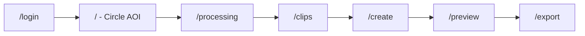

# PRAL v1 - Product Requirements (Frontend)

> **Status:** v1.0 · **Last updated:** 2026-06-13  
> **Scope:** User-facing web app (mock/demo) against typed fixtures. Drone acquisition logic is out of scope - partners integrate Pipeline 1 later.

---

## 1. Vision Alignment

PRAL connects two decoupled pipelines via a **Curated Footage Set** hand-off artifact. See [VISION.md](./VISION.md) and [VISION_FLOW.md](./VISION_FLOW.md).

```
User picks target → Pipeline 1 (drone) → Curated Footage Set → Pipeline 2 (processing) → User picks finished media
```

**This PRD covers only the user-facing web experience.** Pipeline 1 runs as a simulated progress flow; Pipeline 2 is style/platform selection with mock previews and fake export.

---

## 2. Goals

| Goal | Success criteria |
|------|------------------|
| Demonstrate end-to-end happy path | User completes login → target → processing → clips → style → preview → export without dead ends |
| Showcase signature interaction | Circle-to-search AOI selection on satellite map feels polished and intentional |
| Feel like a real product | Loading states, step progress, clear hierarchy, subtle motion |
| Backend-ready architecture | Typed fixtures + swappable mock API; no hardcoded page data |

---

## 3. User Flow



### Step 1 - Login (`/login`)
- Any email/password accepted (demo auth).
- Session stored in `localStorage`.
- Redirect to `/` on success.

### Step 2 - Target Selection (`/`)
- **Primary feature:** Google "Circle to Search"–style interaction on Esri satellite imagery.
- User clicks **Draw circle**, then click-drag outward to define AOI radius.
- Optional target label input.
- CTA **Start acquisition** creates a mission via mock API and navigates to processing.

### Step 3 - Acquisition Progress (`/processing`)
- Animated step list mirroring Pipeline 1 stages from vision doc (survey → sampling → analysis → optimization → production).
- Auto-advances ~1.4s per stage; redirects to `/clips` when complete.

### Step 4 - Clip Review (`/clips`)
- Grid of mock curated clips from `CuratedFootageSet` contract.
- Toggle clip selection; all selected by default.
- Micro-interaction: each clip toggle triggers 300–800ms skeleton state.

### Step 5 - Style & Platform (`/create`)
- **Output styles:** Listing Reel, Social Vertical, Hero Shot, Overview.
- **Destinations:** Instagram, TikTok, YouTube, Facebook, LinkedIn, Website.
- Each option click triggers brief loading skeleton before updating selection.

### Step 6 - Preview (`/preview`)
- Mock preview cards with aspect-ratio-aware thumbnails.
- User selects preferred cut; CTA shows loading before export.

### Step 7 - Export (`/export`)
- Fake progress bar during "render."
- Success state with download button (no real file), share placeholder, and new-mission CTA.

---

## 4. Data Contract

Types live in `src/lib/types.ts`. Fixtures in `fixtures/` provide sample `Mission`, `AOI`, `CuratedFootageSet`, and `PreviewVariant` data matching [VISION.md §6](./VISION.md#6-the-hand-off-contract-curated-footage-set).

### Key entities

| Entity | Purpose |
|--------|---------|
| `AOI` | Geofenced target (center, radius, label) |
| `Mission` | User session state across the flow |
| `FootageClip` | Raw segment with pose, POIs, quality scores |
| `CuratedFootageSet` | Pipeline 1 → 2 hand-off bundle |
| `PreviewVariant` | Assembled template preview for Pipeline 2 |

### Mock API (`src/lib/api/index.ts`)

```typescript
interface ApiClient {
  createMission(aoi: AOI): Promise<Mission>;
  startProcessing(missionId: string): Promise<{ stages }>;
  getFootageSet(missionId, aoi): Promise<CuratedFootageSet>;
  getClips(missionId): Promise<FootageClip[]>;
  generatePreviews(clipIds, style, destination): Promise<PreviewVariant[]>;
  exportMedia(previewId): Promise<{ downloadUrl, filename }>;
}
```

Swap `MockApiClient` for a real HTTP client when backend is ready. Pages should only call `api.*` - never import fixtures directly (except map defaults).

---

## 5. UX & Interaction Spec

### Visual language
- **Palette:** PRAL blue (`pral-*`), neutral surfaces, generous whitespace.
- **Typography:** Inter, clear size hierarchy (page title → section → meta).
- **Components:** Glass panels on map, rounded-2xl cards, subtle card shadows.
- **Motion:** Framer Motion for page enter, option tap, progress animations.

### Micro-interactions (required)
| Trigger | Behavior | Duration |
|---------|----------|----------|
| Style/platform/clip/preview selection | Skeleton overlay on clicked card | 300–800ms random |
| Primary CTA (navigation) | Button spinner + disabled state | 500–900ms |
| Processing page | Step-by-step progress with checkmarks | ~10s total |
| Export page | Progress bar 0→100% | ~2s |

### Map interaction
- Satellite base layer (Esri World Imagery) + labels overlay.
- Draw mode: crosshair cursor, dashed circle while dragging, solid circle on complete.
- Reset / Redraw controls; radius clamped 30–500m.

---

## 6. Tech Stack

| Layer | Choice |
|-------|--------|
| Framework | Next.js 15 (App Router) |
| Language | TypeScript |
| Styling | Tailwind CSS v4 |
| Map | Leaflet + react-leaflet (dynamic import, no SSR) |
| Motion | Framer Motion |
| Icons | Lucide React |
| State | localStorage (auth + active mission) |

---

## 7. Explicitly Out of Scope

- Real drone APIs, MAVLink, or flight planning
- Real video rendering / NLE timeline editor
- Real authentication (OAuth, JWT validation)
- Multi-mission dashboard, user accounts, billing
- Regulatory / airspace tooling
- Live streaming or WebRTC footage

---

## 8. Future Integration Points

1. **`ApiClient.createMission`** → POST mission + AOI to backend; trigger real Pipeline 1.
2. **`/processing`** → WebSocket or polling for real acquisition stage events.
3. **`getFootageSet` / `getClips`** → Fetch from storage after drone lands.
4. **`generatePreviews`** → Trigger Pipeline 2 render jobs; poll for completion.
5. **`exportMedia`** → Return signed S3/CDN URL for actual MP4.

---

## 9. Acceptance Checklist

- [ ] `npm run dev` starts without errors
- [ ] Login with any credentials → lands on map
- [ ] Circle draw creates AOI; CTA disabled until AOI exists
- [ ] Full flow completes through export success screen
- [ ] All option clicks show brief loading state
- [ ] Step indicator in header updates per route
- [ ] Types in `fixtures/` match vision doc contract fields
- [ ] No page imports fixture data directly (API layer only)
