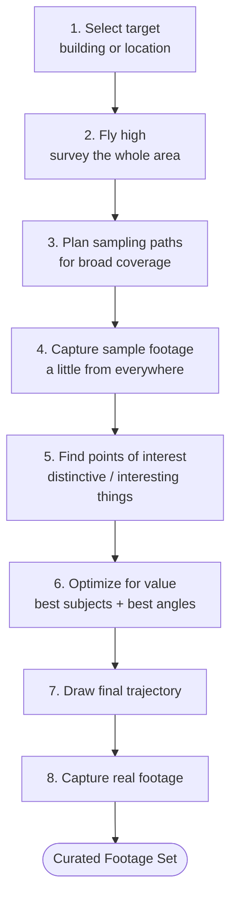
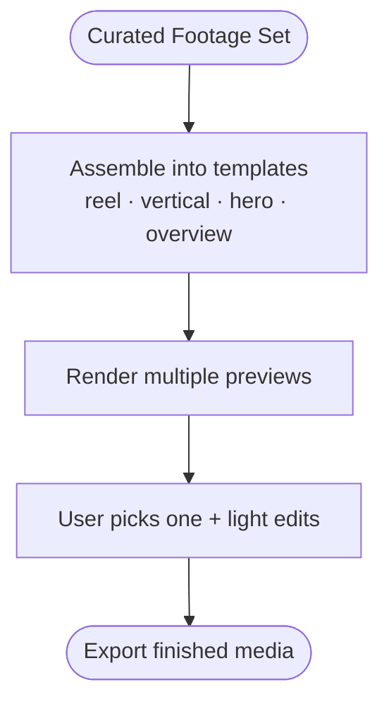

# PRAL - Vision Flowchart

A simple view of how PRAL goes from "film this" to finished media.
See [VISION.md](./VISION.md) for the full write-up.

---

## The Big Picture

---

## Pipeline 1 - Footage Acquisition

The drone figures out what's worth filming, then films it well.

**The idea:** each step narrows down. See everything cheap → sample broadly → find what matters → spend the battery only on the good shots.

---

## Pipeline 2 - Media Processing

The footage becomes marketing-ready media.

