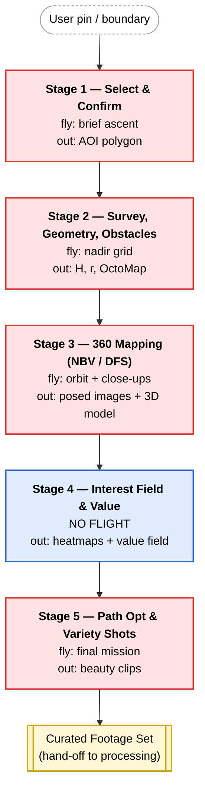
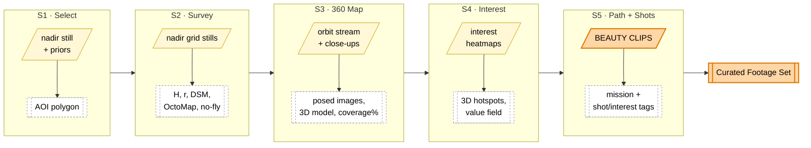
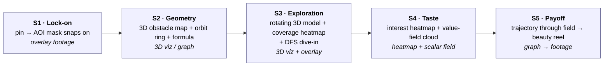

# Footage Acquisition — Pipeline Flowchart

> **Status:** Draft v0.1 · **Scope:** Pipeline 1 only. Diagram companion to [footage-acquisition-pitch-artifacts.md](./footage-acquisition-pitch-artifacts.md).
> **Purpose:** The 5-stage acquisition pipeline as Mermaid diagrams — the high-level flow, the footage-vs-data tracks, and the pitch arc.

---

## 1. High-level pipeline flow

Red = the drone is flying. Blue = pure compute (no flight). Yellow = footage artifact.

---

## 2. Footage vs. data through the pipeline

Top track = pixels (footage). Bottom track = derived data. Note how footage is *spent* in S2/S4 and only *produced for keeps* in S5.

---

## 3. The pitch arc — what we show, stage by stage

**Each slide reveals one box of the pipeline; the only pretty footage is the last beat — which lands harder because the audience has seen everything that earned it.**
