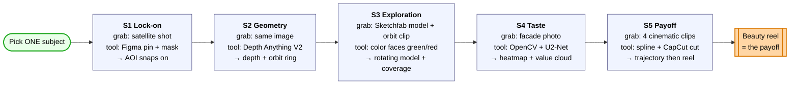
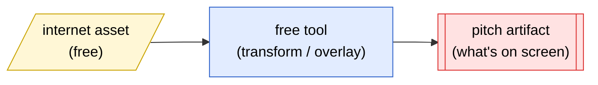

# Footage Acquisition — MVP Pitch Artifacts (Simulated Pipeline)

> **Status:** Draft v0.1 · **Scope:** Pipeline 1 only. Companion to [footage-acquisition-pitch-artifacts.md](./footage-acquisition-pitch-artifacts.md) and [footage-acquisition-flowchart.md](./footage-acquisition-flowchart.md).
> **Purpose:** How to fake every stage's output using free internet assets + free tools, so the pitch *looks* like a real drone run **without flying one**.

---

## Rule 0 — Pick ONE subject and reuse it everywhere

Every artifact must look like the same building/scene, or the demo falls apart. Choose a subject that has **all three** of:

1. A clear Google Maps **satellite** view (for Stage 1–2),
2. **Cinematic drone footage** on free stock sites (for Stage 5),
3. A **photogrammetry / 3D scan** online (for Stage 3–4).

Safe bets: an iconic standalone building — a museum, a modern house, a church — rather than something buried mid-city. Lock the subject first; everything below sources to it.

> Reality check: you won't find the *exact* same building across all sources. Either (a) pick a famous landmark with abundant assets, or (b) accept minor mismatches and lean on consistent color-grading/overlays to tie them together.

---

## The simulate-don't-fly flow

Each stage is the same recipe: **grab a free asset → run a free tool → composite into the pitch artifact.**

---

## Stage-by-stage recipes

Effort: 🟢 ~10 min · 🟡 ~30–60 min · 🔴 a few hours

### Stage 1 — Select & Confirm
| | |
|---|---|
| **Grab from internet** | Google Maps **satellite screenshot** of your subject (top-down) |
| **Free tool to fake it** | Figma / Canva — drop a pin marker, trace a polygon mask over the building, add a detection bounding box |
| **Resulting artifact** | Map screenshot → tap → colored AOI mask snaps onto the building (before/after, or a 3-frame GIF) |
| **Effort** | 🟢 |

### Stage 2 — Survey, Geometry & Obstacles
| | |
|---|---|
| **Grab from internet** | The same satellite/nadir image; an example **OctoMap** screenshot from their gallery |
| **Free tool to fake it** | **Depth Anything V2** (HuggingFace Space — drag image in, get a depth heatmap free); draw the orbit ring circle in Figma; show `r = (H/2 + margin)/tan(VFOV/2)` |
| **Resulting artifact** | Building image + depth heatmap + orbit ring at radius `r` + formula animating to a number |
| **Effort** | 🟡 |

### Stage 3 — 360° Mapping (NBV / DFS)
| | |
|---|---|
| **Grab from internet** | (a) **Orbit drone clip** of a building (Pexels/Pixabay); (b) a **photogrammetry 3D model** from **Sketchfab / Polycam / Luma AI** |
| **Free tool to fake it** | Embed the Sketchfab model (auto-rotates); color faces green/red in a screenshot for the coverage heatmap; animate one "dive-in" arrow for the DFS close-up |
| **Resulting artifact** | Rotating 3D model + green/red coverage overlay + drone-leaves-orbit dive-in animation |
| **Effort** | 🔴 |

### Stage 4 — Interest Field & Value
| | |
|---|---|
| **Grab from internet** | A **facade photo** of your subject (Google Images / Unsplash) |
| **Free tool to fake it** | **OpenCV Canny/LSD** (a few lines) for the clean-lines overlay; **U²-Net saliency** HF demo for the heatmap; blend into one heat overlay. Mock the value field as colored dots around the model in matplotlib/Blender |
| **Resulting artifact** | Facade with glowing heat overlay + 3D cloud of scored camera positions (bright = good shot) |
| **Effort** | 🟡 |

### Stage 5 — Path & Variety Shots
| | |
|---|---|
| **Grab from internet** | 4 **cinematic drone clips** matching shot types — orbit, reveal, push-in, top-down (Pexels/Pixabay/Mixkit) |
| **Free tool to fake it** | Draw a spline through the Stage-4 dots (Figma/Blender), label each segment with its shot type; stitch clips in CapCut/DaVinci |
| **Resulting artifact** | Trajectory threading the value field → hard cut to the **beauty reel** (4 stitched clips) |
| **Effort** | 🟡 |

---

## Free asset shopping list

| Need | Where (all free) |
|---|---|
| Maps / satellite | Google Maps, Google Earth |
| Drone footage | Pexels, Pixabay, Mixkit, Coverr |
| 3D models / splats | Sketchfab, Polycam gallery, Luma AI |
| Depth maps | Depth Anything V2 (HuggingFace Space) |
| Saliency / heatmaps | U²-Net / TRACER HF demos; OpenCV for edges |
| Compositing | Figma / Canva (overlays), CapCut / DaVinci (video cuts) |

---

## Build order (triage for the pitch)

1. **S5 beauty reel first** 🟡 — it's the payoff; if nothing else lands, this does.
2. **S1 lock-on** 🟢 — cheapest, sets up the story.
3. **S2 + S4 overlays** 🟡 — depth map and heatmap are quick wins that prove "it thinks."
4. **S3 3D model** 🔴 — most effort; do last, and a borrowed Sketchfab embed is enough.

> The honest version: 🟢🟡 stages are real-ish (real depth/saliency models run on real images). Only S3's "coverage" and S4's "value cloud" are *mocked* visuals. Call that out internally so nobody oversells the demo.
